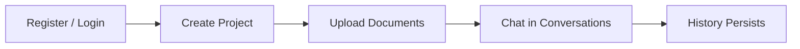
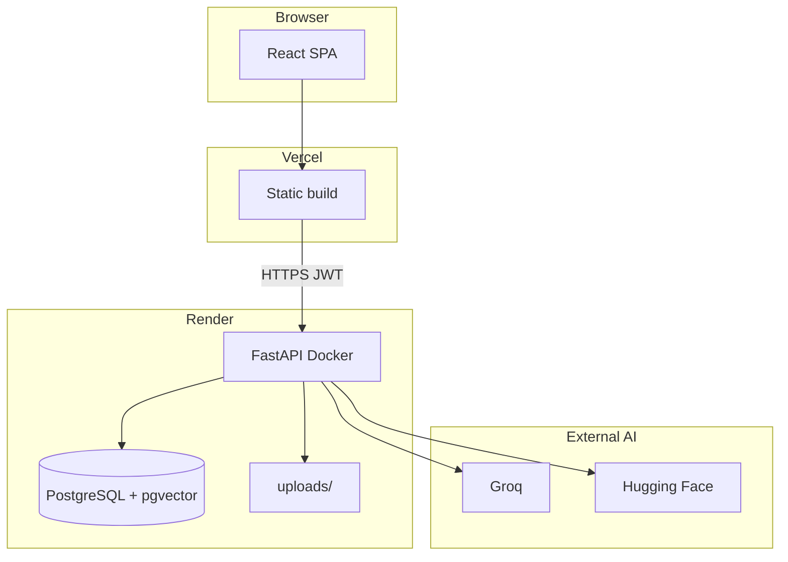
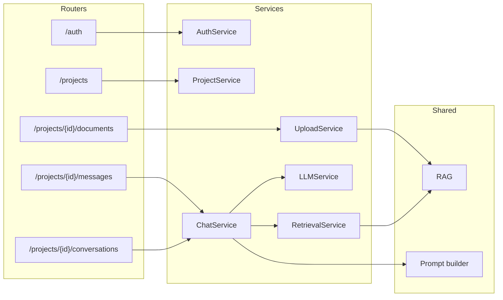
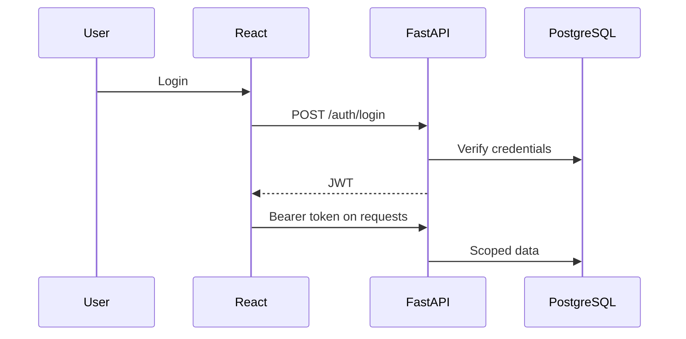
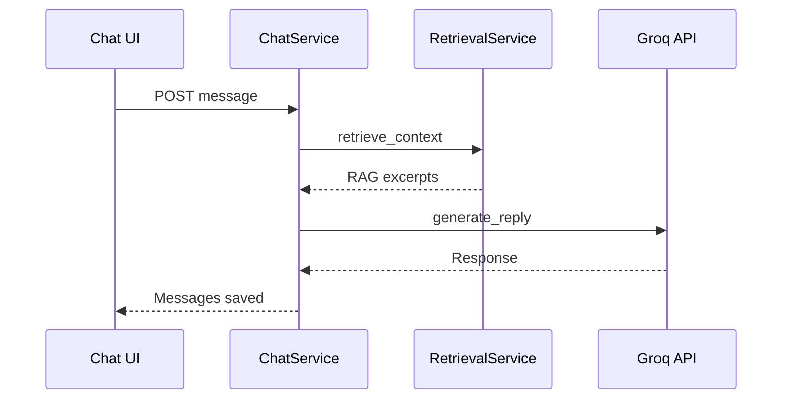

# Chatbot Platform

Multi-tenant AI assistant: users create projects with custom instructions, upload knowledge documents, and chat with a Groq-powered LLM augmented by RAG (retrieval over PostgreSQL/pgvector).

## Live demo

| Service | URL |
|---------|-----|
| Frontend | https://chatbot-platform-assignment.vercel.app |
| Backend API | https://chatbot-platform-assignment-gcfp.onrender.com |
| API docs | https://chatbot-platform-assignment-gcfp.onrender.com/docs |

## Features

- JWT authentication with per-user data isolation
- **Projects** with custom instructions (system prompt) and Groq model settings
- Threaded **conversations** with persisted history
- Knowledge upload (PDF, TXT, MD, JSON, DOCX) with background RAG indexing
- Document-grounded answers via vector search (pgvector or JSON embeddings)
- Configurable input/output moderation
- Project dashboard with usage summaries
- OpenAPI at `/docs` and `/redoc`

## Tech stack

| Layer | Technology |
|-------|------------|
| Frontend | React 18, Vite 6, React Router 7, Axios, Tailwind CSS 3 |
| Backend | FastAPI 0.115, SQLAlchemy 2, Alembic 1.14, python-jose, passlib, httpx, pgvector |
| Database | PostgreSQL 16 (Docker) / 14+ (manual); optional pgvector |
| Chat LLM | Groq API |
| Embeddings | Hugging Face (`BAAI/bge-small-en-v1.5`, dim 384) |
| Hosting | Vercel (frontend), Render (API + Postgres), Docker Compose (local) |

---

## Architecture & design

### Overview

Registered users own **projects** (title, `description`, model settings), **conversations**, and optional **documents**. Tenancy is enforced by `user_id`. Chat uses project instructions plus optional RAG when `RAG_ENABLED=true`.



### High-level system



Modular monolith — one FastAPI deploy, domain-separated modules:

```
chatbot-platform/
├── frontend/src/modules/   authentication · workspace · chat
├── backend/app/
│   ├── core/               config, database, security, CORS
│   ├── modules/            auth · workspace · chat · prompts · file_upload
│   └── shared/             llm · rag · guardrails · storage
└── backend/alembic/        migrations 0001–0010
```

### Frontend routes

| Route | Purpose |
|-------|---------|
| `/login`, `/register` | Authentication |
| `/dashboard` | Project list |
| `/projects/:id`, `/projects/:id/c/:conversationId` | Chat |
| `/projects/:id/settings` | Project settings |

### Backend layers



### Authentication

JWT (HS256), bcrypt passwords, `sub` = user email, default expiry 30 minutes. Endpoints: `POST /auth/register`, `POST /auth/login`, `GET /auth/me`.



### Chat & RAG

**Flow:** moderation (optional) → retrieve top-5 child chunks → expand to parent text (max 12,000 chars) → layered prompt → Groq → persist messages.



**Indexing:** upload → `status=processing` → background extract/chunk/embed child chunks → `ready`. Parent chunks ~1200 tokens (1000–1500); child ~250 (200–300). Embeddings on child chunks only; retrieval expands to parent text.

**Prompt order:** (1) platform guardrails + (2) project `description` + (3) response style → optional RAG system message → history → user message. The `prompts` table is CRUD-only; live chat uses `Project.description`.

### Database schema

| Table | Purpose |
|-------|---------|
| `users`, `projects` | Accounts and agents |
| `conversations`, `chat_messages` | Threads and history |
| `documents`, `document_chunks` | RAG files and embeddings |
| `prompts`, `project_files` | Prompt library, attachments |
| `moderation_events` | Audit log |

### Design rationale

**RAG vs fine-tuning:** RAG lets users upload and query documents immediately without retraining; suited to per-project, frequently updated knowledge.

| Choice | Why |
|--------|-----|
| FastAPI | Async, Pydantic, OpenAPI; fits Groq/HF I/O |
| React + Vite | Interactive chat UI; SPA + JWT REST |
| Postgres + pgvector | One DB for relational + vector data |
| Modular monolith | Simple deploy; clear domain boundaries |
| JWT | Stateless auth for SPA on Render |
| Background indexing | Fast upload response; embed after 201 |

### Limitations

- No response streaming (HTTP request/response only)
- No dedicated vector DB (embeddings in `document_chunks`)
- No microservices or message queue (`BackgroundTasks` only)
- Prompt library not used in live chat
- Local file storage only (`STORAGE_PROVIDER=local`)

---

## Prerequisites

| Requirement | Version |
|-------------|---------|
| Python | 3.13 (`backend/Dockerfile`) |
| Node.js | 20 (`frontend/Dockerfile`) |
| Docker + Compose | Recommended local setup |
| PostgreSQL | 16 (Compose) or 14+ (manual) |
| API keys | [Groq](https://console.groq.com), [Hugging Face](https://huggingface.co/settings/tokens) |

Example env files: [`backend/.env.example`](backend/.env.example), [`frontend/.env.example`](frontend/.env.example).

## Environment variables

### Backend (`backend/.env`)

From [`backend/app/core/config.py`](backend/app/core/config.py).

| Variable | Required | Default | Description |
|----------|----------|---------|-------------|
| `DATABASE_URL` | Yes | — | PostgreSQL connection string |
| `SECRET_KEY` | Yes | — | JWT key (≥ 32 chars) |
| `EMBEDDING_API_KEY` | Yes* | — | *Required for `huggingface` provider |
| `GROQ_API_KEY` | No** | `""` | **Required for chat |
| `RAG_ENABLED` | No | `true` | Enable retrieval |
| `RAG_TOP_K` | No | `5` | Chunks retrieved per query |
| `USE_PGVECTOR` | No | `false` | pgvector column storage |
| `CORS_ORIGINS` | No | localhost origins | Allowed frontend URLs |
| `AUTO_MIGRATE` | No | `true` | Alembic on startup (local dev) |
| `MODERATION_ENABLED` | No | `true` | Input/output moderation |

See [`backend/.env.example`](backend/.env.example) for all settings (`GROQ_*`, `EMBEDDING_*`, `DB_POOL_*`, etc.).

### Frontend (`frontend/.env`)

| Variable | Required | Default | Description |
|----------|----------|---------|-------------|
| `VITE_API_URL` | No | `http://127.0.0.1:8002` | Backend URL (build-time) |

---

## Getting started

### Docker Compose (recommended)

```bash
git clone https://github.com/SHRIYAASK/chatbot-platform_assignment.git
cd chatbot-platform

export GROQ_API_KEY=your-groq-api-key
export EMBEDDING_API_KEY=your-huggingface-token
export SECRET_KEY=$(python -c "import secrets; print(secrets.token_urlsafe(48))")

docker compose up --build
```

**PowerShell:** set `$env:GROQ_API_KEY`, `$env:EMBEDDING_API_KEY`, `$env:SECRET_KEY` then run `docker compose up --build`.

| Service | URL |
|---------|-----|
| Frontend | http://localhost:8080 |
| Backend | http://localhost:8002 |
| API docs | http://localhost:8002/docs |

`entrypoint.sh` runs `alembic upgrade head` before Uvicorn (Compose sets `AUTO_MIGRATE=false`).

### Manual setup

**Backend:**

```bash
cd backend
python -m venv venv
# Windows: .\venv\Scripts\Activate.ps1  |  Unix: source venv/bin/activate
pip install -r requirements-dev.txt
cp .env.example .env
alembic upgrade head
uvicorn app.main:app --host 127.0.0.1 --port 8002
```

**Frontend:**

```bash
cd frontend
npm install
cp .env.example .env
npm run dev
```

Dev server: http://localhost:5173

---

## Database migrations

From `backend/`:

```bash
alembic upgrade head
alembic revision --autogenerate -m "describe change"
```

Current head: `0010_document_failure_reason`.

## Running tests

```bash
cd backend
pip install -r requirements-dev.txt
python -m pytest
```

SQLite test DB; no Postgres required. No frontend test script.

## API documentation

- Swagger UI: `/docs`
- ReDoc: `/redoc`

Health checks: `/health`, `/health/live`, `/health/ready`

## Deployment

| Platform | Repo config | Notes |
|----------|-------------|-------|
| **Render** | `backend/Dockerfile`, `entrypoint.sh` | Set `DATABASE_URL`, `SECRET_KEY`, `GROQ_API_KEY`, `EMBEDDING_*`, `RAG_ENABLED`, `USE_PGVECTOR`, `CORS_ORIGINS` |
| **Vercel** | `frontend/vercel.json` | Set `VITE_API_URL` to Render API URL at build time |

Production: enable `USE_PGVECTOR=true` on Render Postgres for RAG.
