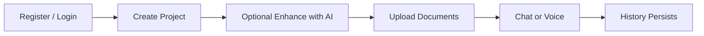
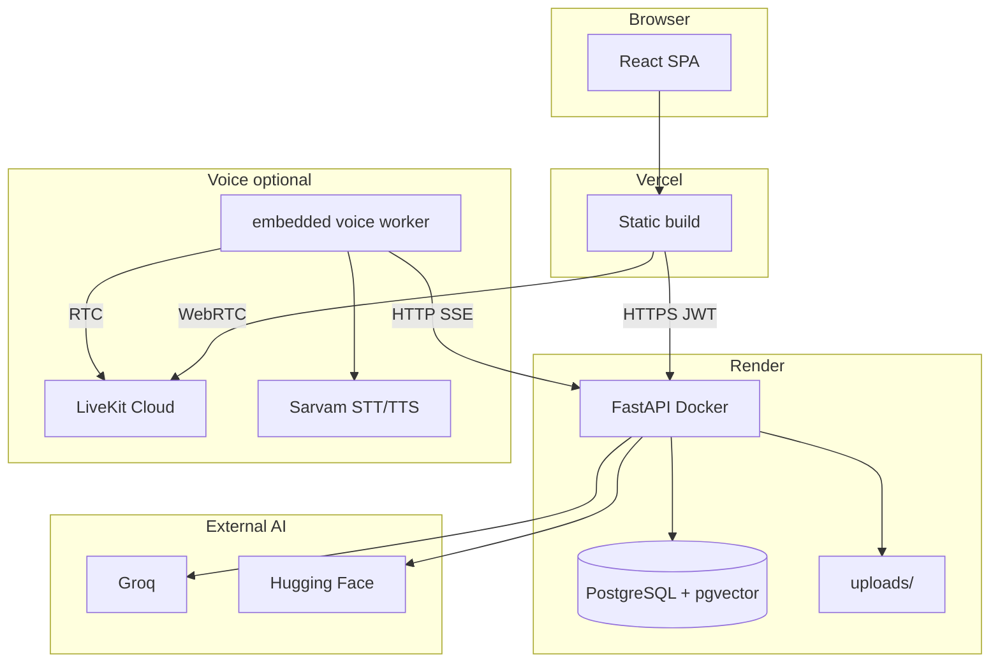
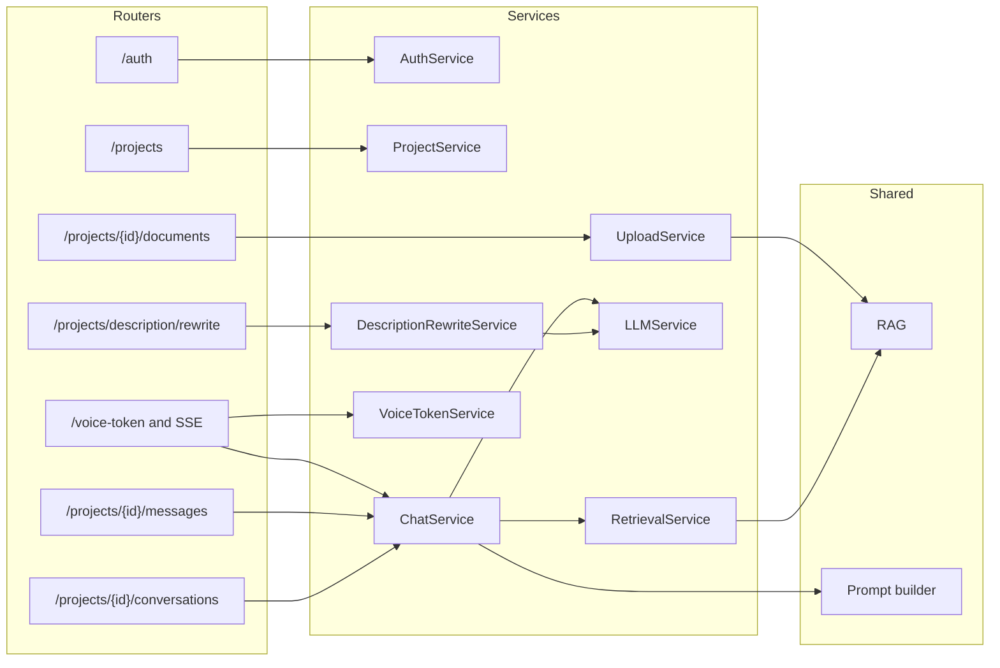
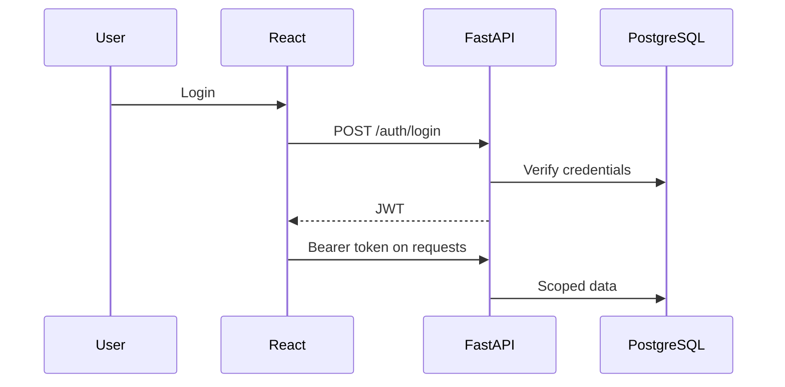
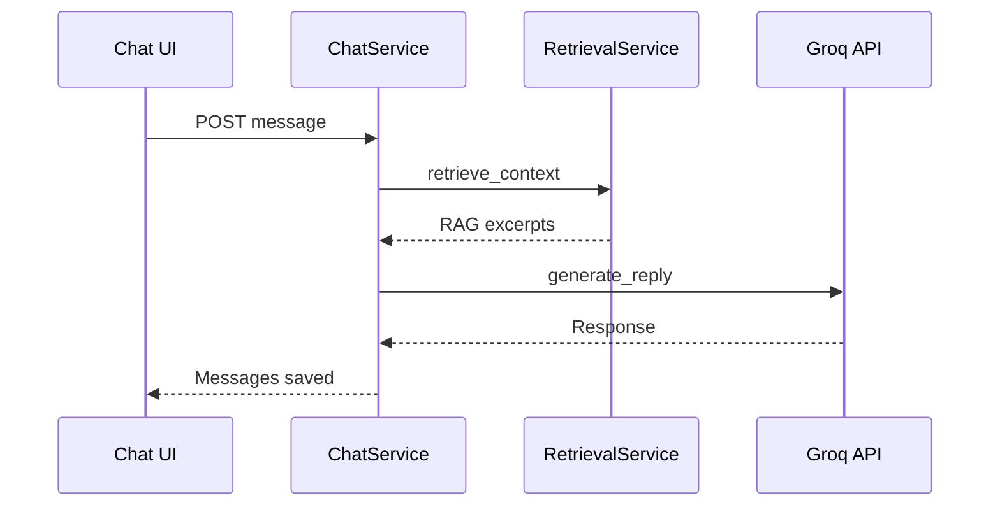
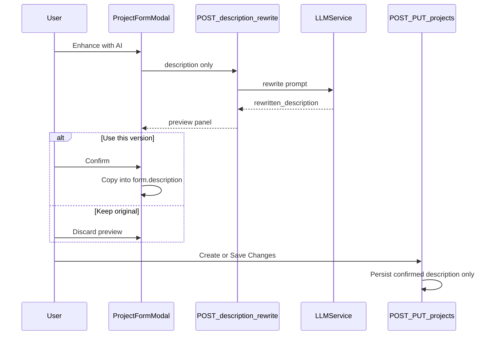
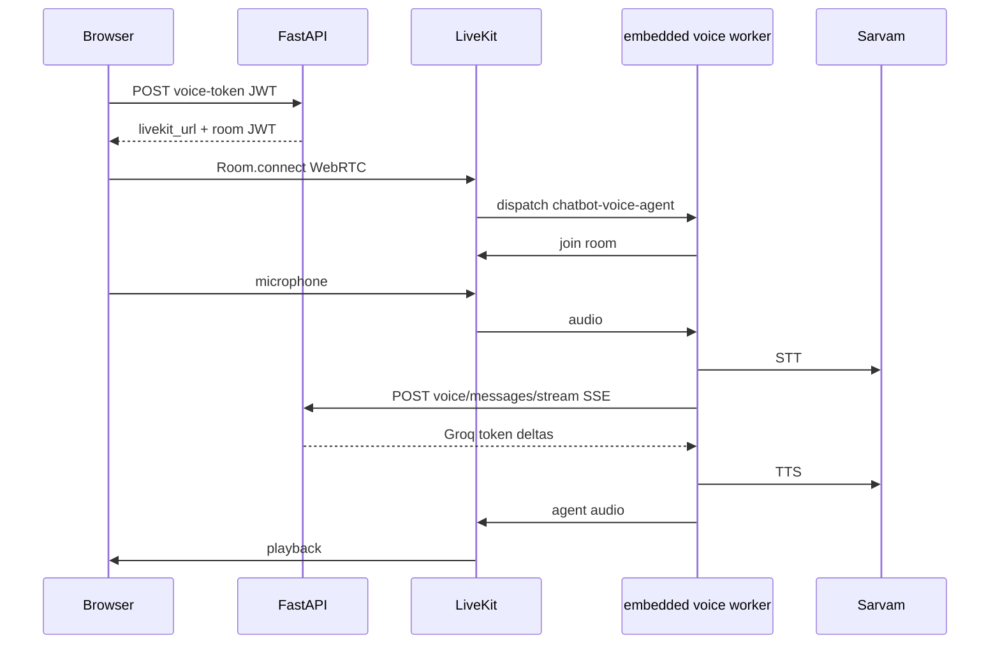

# Chatbot Platform

Multi-tenant AI assistant: users create projects with custom instructions (optionally AI-rewritten before save), upload knowledge documents, and chat or speak with a Groq-powered LLM augmented by RAG (retrieval over PostgreSQL/pgvector).

## Live demo

| Service | URL |
|---------|-----|
| Frontend | https://chatbot-platform-assignment.vercel.app |
| Backend API | https://chatbot-platform-assignment-gcfp.onrender.com |
| API docs | https://chatbot-platform-assignment-gcfp.onrender.com/docs |

## Features

- JWT authentication with per-user data isolation
- **Projects** with custom instructions (system prompt) and Groq model settings
- **Enhance with AI** — rewrite project instructions, preview/edit, then confirm before create/update (never auto-saved)
- Threaded **conversations** with persisted history
- Knowledge upload (PDF, TXT, MD, JSON, DOCX) with background RAG indexing
- Document-grounded answers via vector search (pgvector or JSON embeddings)
- Configurable input/output moderation
- Project dashboard with usage summaries
- **Voice conversations** via LiveKit WebRTC + Sarvam STT/TTS (optional; same `ChatService` as text: moderation, RAG, Groq, persistence)
- OpenAPI at `/docs` and `/redoc`

## Tech stack

| Layer | Technology |
|-------|------------|
| Frontend | React 18, Vite 6, React Router 7, Axios, Tailwind CSS 3, livekit-client |
| Backend | FastAPI 0.115, SQLAlchemy 2, Alembic 1.14, python-jose, passlib, httpx, pgvector |
| Database | PostgreSQL 16 (Docker) / 14+ (manual); optional pgvector |
| Chat LLM | Groq API |
| Embeddings | Hugging Face (`BAAI/bge-small-en-v1.5`, dim 384) |
| Voice (optional) | LiveKit Cloud + Sarvam STT/TTS + embedded voice worker |
| Hosting | Vercel (frontend), Render (API + Postgres), Docker Compose (local) |

---

## Architecture & design

### Overview

Registered users own **projects** (title, `description`, model settings), **conversations**, and optional **documents**. Tenancy is enforced by `user_id`. Chat uses project instructions plus optional RAG when `RAG_ENABLED=true`. Optional voice calls use LiveKit + an embedded voice worker (started with the API) that streams through the same `ChatService` pipeline (moderation, RAG, Groq, persistence). Project descriptions can be rewritten with Groq in a review-and-confirm UI; only confirmed text is saved.



### High-level system



Modular monolith — one FastAPI deploy, domain-separated modules:

```
chatbot-platform/
├── frontend/src/modules/   authentication · workspace · chat
├── backend/app/
│   ├── core/               config, database, security, CORS
│   ├── modules/            auth · workspace · chat · voice · prompts · file_upload
│   └── shared/             llm · rag · guardrails · storage
│   └── modules/voice/worker/  embedded LiveKit worker (Sarvam STT/TTS → backend SSE)
├── voice-agent/            legacy standalone worker (optional; not needed for local dev)
└── backend/alembic/        migrations 0001–0010
```

### Frontend routes

| Route | Purpose |
|-------|---------|
| `/login`, `/register` | Authentication |
| `/dashboard` | Project list |
| `/projects/:id`, `/projects/:id/c/:conversationId` | Chat |
| `/projects/:id/settings` | Project settings |

### Backend layers



### Authentication

JWT (HS256), bcrypt passwords, `sub` = user email, default expiry 30 minutes. Endpoints: `POST /auth/register`, `POST /auth/login`, `GET /auth/me`.



### Chat & RAG

**Flow:** moderation (optional) → retrieve top-5 child chunks → expand to parent text (max 12,000 chars) → layered prompt → Groq → persist messages.



**Indexing:** upload → `status=processing` → background extract/chunk/embed child chunks → `ready`. Parent chunks ~1200 tokens (1000–1500); child ~250 (200–300). Embeddings on child chunks only; retrieval expands to parent text.

**Prompt order:** (1) platform guardrails + (2) project `description` + (3) response style → optional RAG system message → history → user message. The `prompts` table is CRUD-only; live chat uses `Project.description`.

### Description rewrite (review-and-confirm)

`POST /projects/description/rewrite` is a **stateless** Groq transform. It never writes `Project.description`. Only `POST /projects` and `PUT /projects/{id}` persist.

In the create/edit modal: the original textarea stays unchanged while rewrite runs. An **AI-rewritten version** preview appears (editable). The user chooses **Use this version** (copies into the form) or **Keep my original**. Editing the original after a preview discards the preview. Submit still saves whatever is in `form.description`.



Errors: `401` without JWT, `422` invalid length (10–500 chars), `503` if Groq is unconfigured.

### Voice (LiveKit + Sarvam)

Voice is another **transport** into `ChatService`, not a second chatbot. Audio uses LiveKit WebRTC (`wss://…livekit.cloud`). LLM tokens use **HTTP SSE**, not a custom WebSocket.



| Piece | Role |
|-------|------|
| `POST .../voice-token` | User JWT; mints LiveKit room token + short-lived service token in room metadata |
| `POST .../voice/messages/stream` | Service-token auth; SSE from `ChatService.stream_message` (moderation, RAG, Groq, persist) |
| `app/modules/voice/worker/` | Embedded `livekit-agents` worker: Sarvam STT/TTS, Silero VAD, `PassthroughLLM` so inference stays on this backend |
| Frontend `useVoiceCall` | `livekit-client` connects, publishes mic, attaches agent audio |

Room name is `conv-{conversationId}`. Text and voice share the same conversation history.

### Database schema

| Table | Purpose |
|-------|---------|
| `users`, `projects` | Accounts and agents |
| `conversations`, `chat_messages` | Threads and history |
| `documents`, `document_chunks` | RAG files and embeddings |
| `prompts`, `project_files` | Prompt library, attachments |
| `moderation_events` | Audit log |

### Design rationale

**RAG vs fine-tuning:** RAG lets users upload and query documents immediately without retraining; suited to per-project, frequently updated knowledge.

| Choice | Why |
|--------|-----|
| FastAPI | Async, Pydantic, OpenAPI; fits Groq/HF I/O |
| React + Vite | Interactive chat UI; SPA + JWT REST |
| Postgres + pgvector | One DB for relational + vector data |
| Modular monolith | Simple deploy; clear domain boundaries |
| JWT | Stateless auth for SPA on Render |
| Background indexing | Fast upload response; embed after 201 |
| Stateless description rewrite | User confirms AI text before it becomes the system prompt |
| Voice via LiveKit | Real-time audio without a custom WebRTC stack; same ChatService as text |

### Limitations

- Text chat is non-streaming; voice uses streamed Groq responses via the voice-agent worker
- Voice requires LiveKit Cloud + Sarvam credentials; the worker starts automatically with the API when configured
- No dedicated vector DB (embeddings in `document_chunks`)
- No microservices or message queue (`BackgroundTasks` only)
- Prompt library not used in live chat
- Local file storage only (`STORAGE_PROVIDER=local`)

---

## Prerequisites

| Requirement | Version |
|-------------|---------|
| Python | 3.13 (`backend/Dockerfile`) |
| Node.js | 20 (`frontend/Dockerfile`) |
| Docker + Compose | Recommended local setup |
| PostgreSQL | 16 (Compose) or 14+ (manual) |
| API keys | [Groq](https://console.groq.com), [Hugging Face](https://huggingface.co/settings/tokens), optional [LiveKit Cloud](https://cloud.livekit.io/) + [Sarvam](https://www.sarvam.ai/) for voice |

Example env files: [`backend/.env.example`](backend/.env.example), [`frontend/.env.example`](frontend/.env.example).

## Environment variables

### Backend (`backend/.env`)

From [`backend/app/core/config.py`](backend/app/core/config.py).

| Variable | Required | Default | Description |
|----------|----------|---------|-------------|
| `DATABASE_URL` | Yes | — | PostgreSQL connection string |
| `SECRET_KEY` | Yes | — | JWT key (≥ 32 chars) |
| `EMBEDDING_API_KEY` | Yes* | — | *Required for `huggingface` provider |
| `GROQ_API_KEY` | No** | `""` | **Required for chat |
| `RAG_ENABLED` | No | `true` | Enable retrieval |
| `RAG_TOP_K` | No | `5` | Chunks retrieved per query |
| `USE_PGVECTOR` | No | `false` | pgvector column storage |
| `CORS_ORIGINS` | No | localhost origins | Allowed frontend URLs |
| `AUTO_MIGRATE` | No | `true` | Alembic on startup (local dev) |
| `MODERATION_ENABLED` | No | `true` | Input/output moderation |
| `LIVEKIT_URL` | No | `""` | LiveKit Cloud URL (voice) |
| `LIVEKIT_API_KEY` | No | `""` | LiveKit API key (voice) |
| `LIVEKIT_API_SECRET` | No | `""` | LiveKit API secret (voice) |
| `SARVAM_API_KEY` | No | `""` | Sarvam key (embedded voice worker) |
| `BACKEND_INTERNAL_URL` | No | `http://127.0.0.1:8002` | Backend URL the voice worker calls for SSE |
| `VOICE_AGENT_ENABLED` | No | `true` | Start embedded LiveKit worker with the API |

See [`backend/.env.example`](backend/.env.example) for all settings (`GROQ_*`, `EMBEDDING_*`, `DB_POOL_*`, etc.).

### Frontend (`frontend/.env`)

| Variable | Required | Default | Description |
|----------|----------|---------|-------------|
| `VITE_API_URL` | No | `http://127.0.0.1:8002` | Backend URL (build-time) |
| `VITE_LIVEKIT_URL` | No | — | Optional fallback if the voice-token API omits a URL |

---

## Getting started

### Docker Compose (recommended)

```bash
git clone https://github.com/SHRIYAASK/chatbot-platform_assignment.git
cd chatbot-platform

export GROQ_API_KEY=your-groq-api-key
export EMBEDDING_API_KEY=your-huggingface-token
export SECRET_KEY=$(python -c "import secrets; print(secrets.token_urlsafe(48))")
# Optional voice:
# export LIVEKIT_URL=wss://your-project.livekit.cloud
# export LIVEKIT_API_KEY=...
# export LIVEKIT_API_SECRET=...
# export SARVAM_API_KEY=...

docker compose up --build
```

**PowerShell:** set `$env:GROQ_API_KEY`, `$env:EMBEDDING_API_KEY`, `$env:SECRET_KEY` then run `docker compose up --build`.

| Service | URL |
|---------|-----|
| Frontend | http://localhost:8080 |
| Backend | http://localhost:8002 |
| API docs | http://localhost:8002/docs |
| Voice worker | Starts inside the backend when LiveKit + Sarvam env vars are set |

`entrypoint.sh` runs `alembic upgrade head` before Uvicorn (Compose sets `AUTO_MIGRATE=false`).

### Manual setup

**Backend:**

```bash
cd backend
python -m venv venv
# Windows: .\venv\Scripts\Activate.ps1  |  Unix: source venv/bin/activate
pip install -r requirements-dev.txt
cp .env.example .env
alembic upgrade head
uvicorn app.main:app --host 127.0.0.1 --port 8002
```

**Frontend:**

```bash
cd frontend
npm install
cp .env.example .env
npm run dev
```

Dev server: http://localhost:5173

**Voice (optional):** set `LIVEKIT_URL`, `LIVEKIT_API_KEY`, `LIVEKIT_API_SECRET`, and `SARVAM_API_KEY` in `backend/.env`. When you start the API, it automatically spawns the embedded LiveKit worker. Wait until backend logs show `registered worker` for `chatbot-voice-agent`, then use the mic button in chat.

Local dev needs only two processes: backend (`8002`) and frontend (`5173`). Set `VOICE_AGENT_ENABLED=false` only if you run the legacy standalone `voice-agent/` process instead.

---

## Database migrations

From `backend/`:

```bash
alembic upgrade head
alembic revision --autogenerate -m "describe change"
```

Current head: `0010_document_failure_reason`.

## Running tests

```bash
cd backend
pip install -r requirements-dev.txt
python -m pytest
```

SQLite test DB; no Postgres required. No frontend test script.

Includes `test_description_rewrite.py` (rewrite is auth-gated, validated, and does not insert a project) and `test_voice.py` (token minting and service-token stream auth).

## API documentation

- Swagger UI: `/docs`
- ReDoc: `/redoc`

Health checks: `/health`, `/health/live`, `/health/ready`

New feature endpoints:

| Method | Path | Auth | Notes |
|--------|------|------|-------|
| `POST` | `/projects/description/rewrite` | User JWT | Returns `rewritten_description`; no DB write |
| `POST` | `/projects/{id}/conversations/{cid}/voice-token` | User JWT | LiveKit URL + room JWT |
| `POST` | `/projects/{id}/conversations/{cid}/voice/messages/stream` | Voice service token | SSE token stream into `ChatService` |

## Deployment (Render + Vercel)

### Render — backend API

1. Create a **Web Service** from this repo.
2. Set **Root Directory** to `backend` (or use Docker: Dockerfile path `backend/Dockerfile`).
3. **Link a PostgreSQL** database (or paste `DATABASE_URL` / `DATABASE_EXTERNAL_URL`).
4. Set environment variables:

| Variable | Required | Production value |
|----------|----------|------------------|
| `ENVIRONMENT` | Yes | `production` |
| `DATABASE_URL` | Yes | From linked Postgres (auto) |
| `SECRET_KEY` | Yes | Random string ≥ 32 chars |
| `GROQ_API_KEY` | Yes | Groq API key |
| `EMBEDDING_API_KEY` | Yes* | Hugging Face token (*if `RAG_ENABLED=true`) |
| `CORS_ORIGINS` | Yes | `https://your-app.vercel.app` |
| `USE_PGVECTOR` | Yes | `true` |
| `AUTO_MIGRATE` | Yes | `false` (migrations run in `entrypoint.sh`) |
| `BACKEND_INTERNAL_URL` | Yes | `http://127.0.0.1:${PORT}` |
| `LIVEKIT_URL`, `LIVEKIT_API_KEY`, `LIVEKIT_API_SECRET`, `SARVAM_API_KEY` | Voice | LiveKit + Sarvam credentials |
| `VOICE_AGENT_ENABLED` | No | `true` (embedded worker) |

5. Deploy. Logs should show `Database is ready.` then `registered worker` (if voice is configured).

A reference blueprint is in [`render.yaml`](render.yaml). Render auto-expands internal Postgres hostnames (`dpg-*-a`) to external URLs with SSL.

### Vercel — frontend

1. Import the repo; set **Root Directory** to `frontend`.
2. Framework preset: **Vite**.
3. Add environment variable (Production + Preview):

| Variable | Value |
|----------|-------|
| `VITE_API_URL` | `https://your-api.onrender.com` |

4. Deploy. `VITE_API_URL` is baked in at build time — redeploy after changing it.

`frontend/vercel.json` handles SPA routing. CORS allows `*.vercel.app` plus any origins in `CORS_ORIGINS`.

### Production notes

- **File uploads** use local disk on the API container; originals may not survive redeploys. RAG embeddings persist in Postgres.
- **Voice** runs inside the backend container (no separate `voice-agent` process).
- Health checks: `/health/live` (liveness), `/health/ready` (database).
